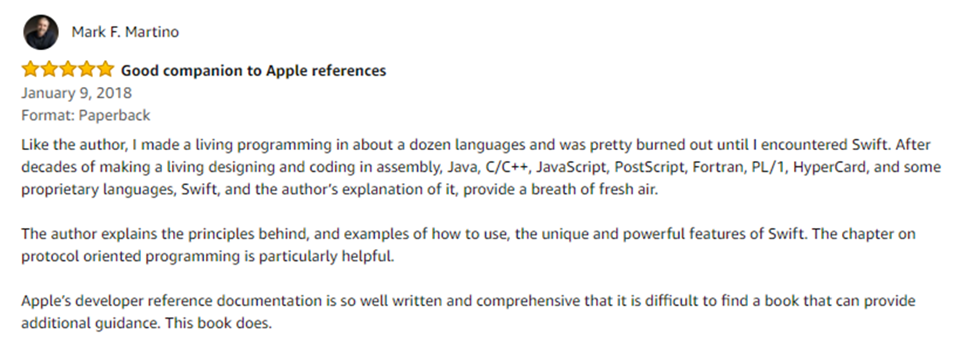

# Swift 4.0

## Mastering Swift 4 - Fourth Edition

Dive into the latest release of the Swift programming language with this advanced development book for building highly performing applications

## What is this book about?
Swift is the definitive language for Apple development today. It's a vital part of any iOS and macOS developer's skillset, helping them to build the most impressive and popular apps on the App Store—the sort of apps that are essential to iPhone and iPad users every day. With version 4.0, the Swift team has added new features to improve the development experience, making it easier to get the results you want and customers expect.
Inside, you'll find the key features of Swift 4.0 and quickly learn how to use the newest updates to your development advantage. From Objective-C interoperability and ARC to closures and concurrency, this advanced Swift guide will develop your expertise and help you become fluent in this vital programming language.
We'll give you an in-depth knowledge of some of the most sophisticated elements of Swift development, including protocol extensions, error-handling, design patterns, and concurrency. We'll guide you on how to use and apply them in your own projects. You'll see how to leverage the power of protocol-oriented programming to write flexible and easier-to-manage code.

## Key Features of Mastering Swift 4 - Fourth Edition
* Harness the latest and most advanced features of Swift 4 to develop quality iOS and macOS applications
*	Comprehensive coverage of all the advanced features of Swift and guidance on advanced design techniques
* Dive deep into protocol extensions, learn new error handling model, and use featured Swift design patterns to write more efficient code
*	Get to grips with advanced design techniques to write smarter, cleaner Swift code

## Who is this book for?
This book is for developers who want to delve into the newest version of Swift. If you are a developer who learns best by looking at and working with code, then this book is for you. A basic understanding of Apple's tools is beneficial but not mandatory. If you feel this book is for you, get your copy today!

## What will you learn from this book?
*	Delve into the core components of Swift 4.0, including operators, collections, control flows, and functions
*	Create and use classes, structures, and enumerations
*	Understand protocol-oriented design and see how it can help you write better code
*	Develop a practical understanding of subscripts and extensions
*	Add concurrency to your applications using Grand Central Dispatch and Operation Queues
*	Implement generics and closures to write very flexible and reusable code
*	Make use of Swift’s error handling and availability features to write safer code

## Amazon Reviews

## Where can you buy this book?
*	Amazon -https://www.amazon.com/Mastering-Swift-depth-comprehensive-programming-ebook/dp/B073WGJ566

*	Packt- https://www.packtpub.com/application-development/mastering-swift-4-fourth-edition?utm_source=github&utm_medium=authorengagement&utm_campaign=9781788477802

## Get to Know the Author
Jon Hoffman 
 
Jon Hoffman has over 25 years of experience in the field of information technology. Over these years, Jon has worked in the areas of system administration, network administration, network security, application development, and architecture. Currently, Jon works as a senior software engineer for Syn-Tech Systems.

Jon has developed extensively for the iOS platform since 2008. This includes several apps that he has published in the App Store, apps that he has written for third parties, and numerous enterprise applications. He has also developed mobile applications for the Android and Windows platforms. What really drives Jon the challenges that the field of information technology provides and there is nothing more exhilarating to him than overcoming a challenge.

Some of Jon’s other interests are spending time with his family, robotic projects, and 3D printing. Jon also really enjoys Tae Kwon Do, where he and his oldest daughter Kailey earned their black belts together early in 2014, Kim (his wife) earned her black belt in December 2014, and his youngest daughter Kara is currently working towards her black belt.

Amazon -https://www.amazon.com/Jon-Hoffman/e/B01N5KH2FP/ref=dp_byline_cont_book_1

